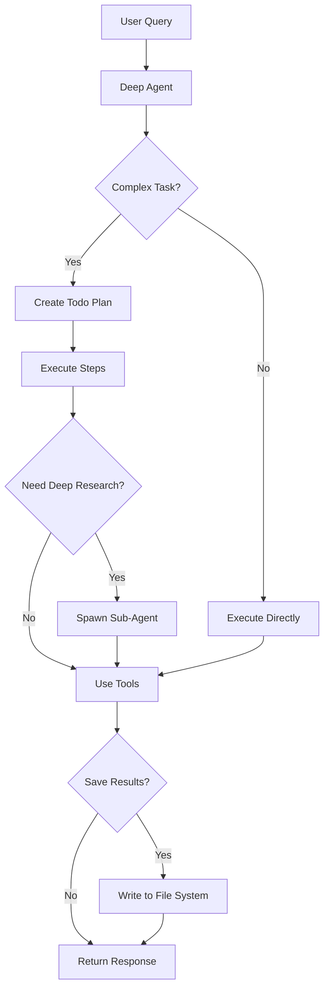

# Stock Analysis Deep Agent

> **v1.0.0** - Now with LangChain 1.0 Multi-Provider Support! 🎉

A powerful stock market analysis agent built using the [Deep Agents](https://github.com/langchain-ai/deepagents) framework. This agent combines planning, file system access, and sub-agent capabilities to perform sophisticated stock market analysis.

**New in v1.0:** Support for **15+ LLM providers** using LangChain 1.0's unified `init_chat_model` API - easily switch between OpenAI, Anthropic, Google, Groq, Ollama, and many more!

## What are Deep Agents?

Deep Agents are an architectural pattern that enables AI agents to handle complex, long-horizon tasks by implementing four key components:

1. **Planning Tool** - Break down complex analyses into manageable steps
2. **File System Backend** - Save reports, data, and maintain context across tasks
3. **Sub-agents** - Spawn specialized agents for deep research
4. **Detailed System Prompt** - Expert-level guidance for stock analysis

This architecture moves beyond simple tool-calling loops to enable truly sophisticated agentic behavior.

Read more: [Deep Agents Blog Post](https://blog.langchain.com/deep-agents/)

## Features

### 🎯 Core Capabilities

- **Real-time Stock Data**: Fetch current quotes, prices, volume, and market data
- **Historical Analysis**: Calculate price changes over multiple timeframes (1d, 5d, 1mo, 3mo, 6mo, 1y)
- **News Integration**: Search and analyze recent news about stocks and companies
- **Multi-Stock Comparison**: Compare multiple stocks side by side
- **Comprehensive Reports**: Generate and save detailed analysis reports

### 🧠 Deep Agent Capabilities

- **Task Planning**: Automatically breaks down complex analyses into steps
- **File Management**: Saves findings, reports, and data to organized files
- **Sub-agent Research**: Spawns specialized agents for deep dives into sectors or topics
- **Context Preservation**: Maintains analysis state across long research sessions

### ✨ Multi-Provider Support (LangChain 1.0)

**15+ LLM Providers Supported:**

| Provider | Package | Example Models |
|----------|---------|----------------|
| **OpenAI** | `langchain-openai` | GPT-4o, GPT-4 Turbo, GPT-3.5 |
| **Anthropic** | `langchain-anthropic` | Claude Sonnet 4, Claude Opus 4 |
| **Google Gemini** | `langchain-google-genai` | Gemini 2.0 Flash, Gemini 1.5 Pro |
| **Groq** | `langchain-groq` | Llama 3.3 70B, Mixtral 8x7B |
| **Cohere** | `langchain-cohere` | Command R+, Command R |
| **Mistral AI** | `langchain-mistralai` | Mistral Large, Mistral Medium |
| **Ollama** | `langchain-ollama` | Llama 3.2, Mistral, Phi3 (Local!) |
| **Together AI** | `langchain-together` | Llama 3.1 70B, Mixtral |
| **Fireworks AI** | `langchain-fireworks` | Llama 3.1 70B |
| **AWS Bedrock** | `langchain-aws` | Claude on Bedrock, Llama on Bedrock |
| **Azure OpenAI** | `langchain-openai` | GPT-4o, GPT-4 Turbo (Azure) |
| **DeepSeek** | `langchain-openai` | DeepSeek Chat, DeepSeek Coder |
| **xAI Grok** | `langchain-xai` | Grok 2, Grok Vision |
| **Perplexity** | `langchain-community` | Sonar Pro, Sonar |
| **Google Vertex AI** | `langchain-google-vertexai` | Gemini on Vertex AI |

**Key Benefits:**
- ✅ Unified API across all providers
- ✅ Easy provider switching with no code changes
- ✅ Support for both cloud and local models (Ollama)
- ✅ Auto-detection of provider from model name
- ✅ Consistent interface for model parameters

## Installation

### Prerequisites

- Python 3.11+
- API key for your chosen LLM provider(s)

### Setup

1. Clone this repository:
```bash
git clone <repository-url>
cd german-tutor
```

2. Install dependencies:
```bash
# Install base dependencies (includes Anthropic and OpenAI)
pip install -r requirements.txt

# Optional: Install additional providers as needed
pip install langchain-google-genai  # For Google Gemini
pip install langchain-groq          # For Groq
pip install langchain-cohere        # For Cohere
pip install langchain-ollama        # For Ollama (local models)
# ... see requirements.txt for full list
```

3. Set your API key:
```bash
# See .env.example for all supported providers

# For Anthropic Claude (default)
export ANTHROPIC_API_KEY='your-anthropic-key-here'

# For OpenAI GPT
export OPENAI_API_KEY='your-openai-key-here'

# For Google Gemini
export GOOGLE_API_KEY='your-google-key-here'

# For Groq
export GROQ_API_KEY='your-groq-key-here'

# ... etc
```

## Quick Start

### Basic Usage (Default Provider)

```python
from stock_analysis_agent import create_stock_analysis_agent, run_analysis

# Create the agent (uses Anthropic Claude by default)
agent = create_stock_analysis_agent()

# Run an analysis
response = run_analysis(
    "What's the current price of Apple stock?",
    agent=agent
)
```

### Multi-Provider Usage

```python
from stock_analysis_agent import create_stock_analysis_agent

# Method 1: Auto-detection from model name
agent = create_stock_analysis_agent(model="gpt-4o")  # Detects OpenAI
agent = create_stock_analysis_agent(model="claude-sonnet-4-20250514")  # Detects Anthropic
agent = create_stock_analysis_agent(model="gemini-2.0-flash")  # Detects Google

# Method 2: Explicit provider specification
agent = create_stock_analysis_agent(
    provider="openai",
    model="gpt-4o"
)

# Method 3: Provider:model format
agent = create_stock_analysis_agent(model="openai:gpt-4o")
agent = create_stock_analysis_agent(model="anthropic:claude-sonnet-4-20250514")
agent = create_stock_analysis_agent(model="google_genai:gemini-2.0-flash")

# Method 4: Local models with Ollama (no API key needed!)
agent = create_stock_analysis_agent(
    provider="ollama",
    model="llama3.2"
)

# With custom parameters
agent = create_stock_analysis_agent(
    model="gpt-4o",
    temperature=0.2,
    max_tokens=4096
)
```

### List Available Providers

```python
from stock_analysis_agent import list_providers

# Show all supported providers with details
list_providers()
```

### Command Line Usage

```bash
# Run with default provider
python stock_analysis_agent/agent.py

# List all supported providers
python -c "from stock_analysis_agent import list_providers; list_providers()"
```

### Running Examples

```bash
# Simple examples
python examples/simple_analysis.py

# Advanced examples with Deep Agent features
python examples/advanced_analysis.py

# Multi-provider examples (NEW!)
python examples/multi_provider_example.py
```

## Usage Examples

### Example 1: Simple Stock Quote

```python
agent = create_stock_analysis_agent()

run_analysis(
    "What's the current price of Tesla (TSLA)?",
    agent=agent
)
```

**The agent will:**
- Fetch current TSLA quote
- Present price, volume, and day's performance
- Provide clear, formatted output

### Example 2: Comprehensive Analysis (Planning in Action)

```python
run_analysis(
    """Analyze NVIDIA's performance including:
    - Current price
    - 1-month, 3-month, and 1-year trends
    - Recent news
    - Save findings to a report""",
    agent=agent
)
```

**The agent will:**
1. Create a todo list to plan the analysis
2. Execute each step systematically
3. Fetch data from multiple tools
4. Compile findings into a report
5. Save the report to the file system

### Example 3: Multi-Stock Comparison

```python
run_analysis(
    "Compare Apple, Microsoft, and Google stock performance",
    agent=agent
)
```

**The agent will:**
- Fetch data for all three stocks
- Calculate comparative metrics
- Highlight key differences
- Present side-by-side comparison

### Example 4: Deep Sector Research (Sub-agents)

```python
run_analysis(
    """Conduct deep research on the semiconductor sector.
    Analyze major players (NVDA, AMD, INTC, TSM) and
    industry trends. Save to semiconductor_analysis.md""",
    agent=agent
)
```

**The agent will:**
- Plan a comprehensive research strategy
- Potentially spawn a sub-agent for detailed research
- Gather data across multiple stocks
- Analyze industry trends
- Compile findings into a structured report
- Save to the file system

### Example 5: Using Different LLM Providers

```python
# Use OpenAI GPT-4
openai_agent = create_stock_analysis_agent(model="gpt-4o")
run_analysis("What's Microsoft's stock price?", openai_agent)

# Use Google Gemini
gemini_agent = create_stock_analysis_agent(model="google_genai:gemini-2.0-flash")
run_analysis("What's Apple's stock price?", gemini_agent)

# Use Groq (fast inference, great for development)
groq_agent = create_stock_analysis_agent(model="groq:llama-3.3-70b-versatile")
run_analysis("What's Tesla's stock price?", groq_agent)

# Use Ollama (local model, no API key needed!)
ollama_agent = create_stock_analysis_agent(model="ollama:llama3.2")
run_analysis("What's Amazon's stock price?", ollama_agent)
```

## Architecture

### Project Structure

```
stock_analysis_agent/
├── __init__.py           # Package initialization
├── agent.py              # Main Deep Agent creation with multi-provider support
├── tools.py              # Stock analysis tools (quote, news, etc.)
└── prompts.py            # System prompts for agent and sub-agents

examples/
├── simple_analysis.py        # Basic usage examples
├── advanced_analysis.py      # Advanced Deep Agent features
└── multi_provider_example.py # Multi-provider demonstrations (NEW!)

stock_analysis_workspace/ # Default workspace for file system
requirements.txt          # Dependencies (LangChain 1.0)
.env.example             # API key configuration template
test_agent.py            # Test suite
```

### Tools Available

1. **get_stock_quote(ticker)** - Fetch current stock data
2. **search_stock_news(ticker, num_results)** - Find recent news
3. **calculate_price_change(ticker, period)** - Analyze price trends
4. **compare_stocks(tickers)** - Compare multiple stocks

Plus Deep Agent built-ins:
- **write_todos** - Plan complex analyses
- **read_file**, **write_file**, **edit_file** - File system access
- **task** - Spawn sub-agents for specialized research

### How It Works



## Configuration

### Using Different LLM Providers

The agent uses **LangChain 1.0's unified `init_chat_model` API**, which provides a consistent interface across all providers:

```python
# All these methods work the same way:
agent = create_stock_analysis_agent(
    model="model-name",              # Auto-detects provider
    provider="provider-name",         # Optional: explicit provider
    temperature=0.1,                  # Model temperature
    max_tokens=4096,                  # Maximum response length
    **other_model_params             # Any provider-specific params
)
```

### Recommended Providers for Stock Analysis

| Provider | Speed | Cost | Quality | Best For |
|----------|-------|------|---------|----------|
| **Anthropic Claude** | Fast | $$$ | Excellent | Complex analysis, multi-step reasoning |
| **OpenAI GPT-4** | Fast | $$$ | Excellent | General purpose, reliable |
| **Google Gemini** | Very Fast | $$ | Very Good | Fast analysis, cost-effective |
| **Groq** | Ultra Fast | $ | Good | Development, quick queries |
| **Ollama (Local)** | Medium | Free | Good | Privacy, offline use, experimentation |

### File System Workspace

The agent saves its work to a workspace directory (default: `stock_analysis_workspace/`):

```
stock_analysis_workspace/
├── aapl_analysis.md          # Saved reports
├── aapl_data.json            # Raw data
├── tech_comparison.md        # Comparison reports
└── sector_research/          # Sub-agent outputs
    └── semiconductor_report.md
```

## Best Practices

### For Simple Queries
- Direct questions get direct answers
- No need for elaborate instructions
- Example: "What's AAPL trading at?"

### For Complex Analyses
- Be specific about what you want analyzed
- Mention if you want reports saved
- The agent will create a plan automatically
- Example: "Analyze top 5 tech stocks, compare their 1-year performance, and save to a report"

### For Deep Research
- Request comprehensive sector or industry analysis
- The agent will spawn sub-agents as needed
- Specify desired output format
- Example: "Research the EV industry including TSLA, RIVN, LCID with market trends"

### Choosing an LLM Provider

**For Production:**
- Use Anthropic Claude or OpenAI GPT-4 for best quality
- Consider Google Gemini for cost-effectiveness

**For Development:**
- Use Groq for ultra-fast iteration
- Use Ollama for free, local testing

**For Privacy:**
- Use Ollama with local models (no data leaves your machine)

## Limitations & Disclaimers

⚠️ **Important Notes:**

1. **Not Financial Advice**: This tool provides information only, not investment advice
2. **Data Accuracy**: Stock data comes from public APIs and may have delays
3. **Rate Limits**: API calls are subject to provider rate limits
4. **Market Hours**: Some data may be unavailable outside market hours
5. **Past Performance**: Historical data doesn't guarantee future results
6. **LLM Limitations**: Different providers may produce different results

**Always consult qualified financial advisors before making investment decisions.**

## Troubleshooting

### Common Issues

**"No API key found"**
- Set the appropriate environment variable for your provider
- See `.env.example` for all supported providers

**"Failed to fetch data for ticker"**
- Check ticker symbol is correct (use uppercase)
- Verify stock exists and is publicly traded
- Some stocks may not be available via the data source

**"Missing package for [provider]"**
- Install the required package: `pip install langchain-[provider]`
- Example: `pip install langchain-groq`

**"Rate limit exceeded"**
- You've made too many requests - wait and try again
- Consider using a different API key tier or provider

**"Model not found"**
- Check the model name is correct for your provider
- Use `list_providers()` to see available models

## Testing

Run the test suite to verify your installation:

```bash
python test_agent.py
```

This will test:
- Package imports (including LangChain 1.0)
- Tool availability
- System prompts
- Provider configuration
- Agent creation (if API keys are set)

## Learn More

### Deep Agents Resources
- [Deep Agents Blog Post](https://blog.langchain.com/deep-agents/)
- [Deep Agents GitHub](https://github.com/langchain-ai/deepagents)
- [LangChain Documentation](https://docs.langchain.com/)

### LangChain 1.0
- [LangChain 1.0 Announcement](https://blog.langchain.com/langchain-langgraph-1dot0/)
- [init_chat_model Documentation](https://python.langchain.com/docs/how_to/chat_models_universal_init/)

### Stock Analysis
- This agent uses Yahoo Finance data via public APIs
- For production use, consider premium data providers

## Contributing

Contributions welcome! Areas for improvement:

- Additional data sources (Alpha Vantage, Finnhub, etc.)
- More analysis tools (technical indicators, fundamentals)
- Enhanced visualization capabilities
- Multi-language support
- Additional LLM provider integrations

## Changelog

### v1.0.0 (Current)
- **BREAKING:** Migrated to LangChain 1.0
- **NEW:** Support for 15+ LLM providers via `init_chat_model`
- **NEW:** Unified API across all providers
- **NEW:** Multi-provider examples
- **NEW:** `list_providers()` helper function
- **IMPROVED:** Better error messages and provider detection
- **IMPROVED:** Enhanced documentation

### v0.1.0
- Initial release with Anthropic and OpenAI support
- Deep Agents framework integration
- Stock analysis tools

## License

MIT License - See LICENSE file for details

## Acknowledgments

Built with:
- [Deep Agents](https://github.com/langchain-ai/deepagents) by LangChain
- [LangChain 1.0](https://www.langchain.com/) for unified LLM integration
- [LangGraph](https://github.com/langchain-ai/langgraph) for agent orchestration
- Multiple LLM providers: Anthropic, OpenAI, Google, and many more

---

**Happy Analyzing! 📈**

*Remember: This is a tool for information and learning. Always do your own research and consult professionals before making investment decisions.*
