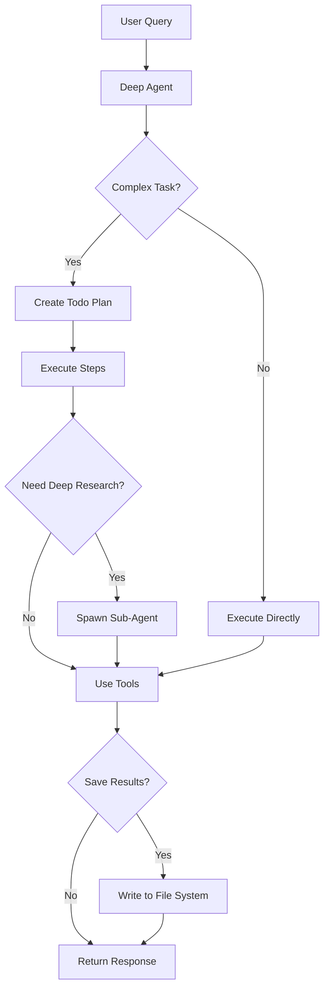

# Stock Analysis Deep Agent

A powerful stock market analysis agent built using the [Deep Agents](https://github.com/langchain-ai/deepagents) framework. This agent combines planning, file system access, and sub-agent capabilities to perform sophisticated stock market analysis.

## What are Deep Agents?

Deep Agents are an architectural pattern that enables AI agents to handle complex, long-horizon tasks by implementing four key components:

1. **Planning Tool** - Break down complex analyses into manageable steps
2. **File System Backend** - Save reports, data, and maintain context across tasks
3. **Sub-agents** - Spawn specialized agents for deep research
4. **Detailed System Prompt** - Expert-level guidance for stock analysis

This architecture moves beyond simple tool-calling loops to enable truly sophisticated agentic behavior.

Read more: [Deep Agents Blog Post](https://blog.langchain.com/deep-agents/)

## Features

### 🎯 Core Capabilities

- **Real-time Stock Data**: Fetch current quotes, prices, volume, and market data
- **Historical Analysis**: Calculate price changes over multiple timeframes (1d, 5d, 1mo, 3mo, 6mo, 1y)
- **News Integration**: Search and analyze recent news about stocks and companies
- **Multi-Stock Comparison**: Compare multiple stocks side by side
- **Comprehensive Reports**: Generate and save detailed analysis reports

### 🧠 Deep Agent Capabilities

- **Task Planning**: Automatically breaks down complex analyses into steps
- **File Management**: Saves findings, reports, and data to organized files
- **Sub-agent Research**: Spawns specialized agents for deep dives into sectors or topics
- **Context Preservation**: Maintains analysis state across long research sessions

## Installation

### Prerequisites

- Python 3.11+
- API key for either Anthropic (Claude) or OpenAI (GPT-4)

### Setup

1. Clone this repository:
```bash
git clone <repository-url>
cd german-tutor
```

2. Install dependencies:
```bash
pip install -r requirements.txt
```

3. Set your API key:
```bash
# For Anthropic Claude
export ANTHROPIC_API_KEY='your-anthropic-key-here'

# OR for OpenAI GPT-4
export OPENAI_API_KEY='your-openai-key-here'
```

## Quick Start

### Basic Usage

```python
from stock_analysis_agent import create_stock_analysis_agent, run_analysis

# Create the agent
agent = create_stock_analysis_agent()

# Run an analysis
response = run_analysis(
    "What's the current price of Apple stock?",
    agent=agent
)
```

### Using the Command Line

```bash
# Simple quote
python stock_analysis_agent/agent.py
```

### Running Examples

```bash
# Simple examples
python examples/simple_analysis.py

# Advanced examples with Deep Agent features
python examples/advanced_analysis.py
```

## Usage Examples

### Example 1: Simple Stock Quote

```python
agent = create_stock_analysis_agent()

run_analysis(
    "What's the current price of Tesla (TSLA)?",
    agent=agent
)
```

**The agent will:**
- Fetch current TSLA quote
- Present price, volume, and day's performance
- Provide clear, formatted output

### Example 2: Comprehensive Analysis (Planning in Action)

```python
run_analysis(
    """Analyze NVIDIA's performance including:
    - Current price
    - 1-month, 3-month, and 1-year trends
    - Recent news
    - Save findings to a report""",
    agent=agent
)
```

**The agent will:**
1. Create a todo list to plan the analysis
2. Execute each step systematically
3. Fetch data from multiple tools
4. Compile findings into a report
5. Save the report to the file system

### Example 3: Multi-Stock Comparison

```python
run_analysis(
    "Compare Apple, Microsoft, and Google stock performance",
    agent=agent
)
```

**The agent will:**
- Fetch data for all three stocks
- Calculate comparative metrics
- Highlight key differences
- Present side-by-side comparison

### Example 4: Deep Sector Research (Sub-agents)

```python
run_analysis(
    """Conduct deep research on the semiconductor sector.
    Analyze major players (NVDA, AMD, INTC, TSM) and
    industry trends. Save to semiconductor_analysis.md""",
    agent=agent
)
```

**The agent will:**
- Plan a comprehensive research strategy
- Potentially spawn a sub-agent for detailed research
- Gather data across multiple stocks
- Analyze industry trends
- Compile findings into a structured report
- Save to the file system

## Architecture

### Project Structure

```
stock_analysis_agent/
├── __init__.py           # Package initialization
├── agent.py              # Main Deep Agent creation and execution
├── tools.py              # Stock analysis tools (quote, news, etc.)
└── prompts.py            # System prompts for agent and sub-agents

examples/
├── simple_analysis.py    # Basic usage examples
└── advanced_analysis.py  # Advanced Deep Agent features

stock_analysis_workspace/ # Default workspace for file system
```

### Tools Available

1. **get_stock_quote(ticker)** - Fetch current stock data
2. **search_stock_news(ticker, num_results)** - Find recent news
3. **calculate_price_change(ticker, period)** - Analyze price trends
4. **compare_stocks(tickers)** - Compare multiple stocks

Plus Deep Agent built-ins:
- **write_todos** - Plan complex analyses
- **read_file**, **write_file**, **edit_file** - File system access
- **task** - Spawn sub-agents for specialized research

### How It Works



## Configuration

### Customizing the Agent

```python
agent = create_stock_analysis_agent(
    model_provider="anthropic",        # or "openai"
    model_name="claude-sonnet-4-20250514",  # specific model
    api_key="your-key",                # or set via environment
    workspace_dir="./custom_workspace"  # custom file location
)
```

### Available Models

**Anthropic:**
- `claude-sonnet-4-20250514` (default, recommended)
- `claude-opus-4-20250514`

**OpenAI:**
- `gpt-4o` (default)
- `gpt-4-turbo`

## File System Workspace

The agent saves its work to a workspace directory (default: `stock_analysis_workspace/`):

```
stock_analysis_workspace/
├── aapl_analysis.md          # Saved reports
├── aapl_data.json            # Raw data
├── tech_comparison.md        # Comparison reports
└── sector_research/          # Sub-agent outputs
    └── semiconductor_report.md
```

## Best Practices

### For Simple Queries
- Direct questions get direct answers
- No need for elaborate instructions
- Example: "What's AAPL trading at?"

### For Complex Analyses
- Be specific about what you want analyzed
- Mention if you want reports saved
- The agent will create a plan automatically
- Example: "Analyze top 5 tech stocks, compare their 1-year performance, and save to a report"

### For Deep Research
- Request comprehensive sector or industry analysis
- The agent will spawn sub-agents as needed
- Specify desired output format
- Example: "Research the EV industry including TSLA, RIVN, LCID with market trends"

## Limitations & Disclaimers

⚠️ **Important Notes:**

1. **Not Financial Advice**: This tool provides information only, not investment advice
2. **Data Accuracy**: Stock data comes from public APIs and may have delays
3. **Rate Limits**: API calls are subject to provider rate limits
4. **Market Hours**: Some data may be unavailable outside market hours
5. **Past Performance**: Historical data doesn't guarantee future results

**Always consult qualified financial advisors before making investment decisions.**

## Troubleshooting

### Common Issues

**"No API key found"**
- Set `ANTHROPIC_API_KEY` or `OPENAI_API_KEY` environment variable

**"Failed to fetch data for ticker"**
- Check ticker symbol is correct (use uppercase)
- Verify stock exists and is publicly traded
- Some stocks may not be available via the data source

**"Rate limit exceeded"**
- You've made too many requests - wait and try again
- Consider using a different API key tier

## Learn More

### Deep Agents Resources
- [Deep Agents Blog Post](https://blog.langchain.com/deep-agents/)
- [Deep Agents GitHub](https://github.com/langchain-ai/deepagents)
- [LangChain Documentation](https://docs.langchain.com/oss/python/deepagents/overview)

### Stock Analysis
- This agent uses Yahoo Finance data via public APIs
- For production use, consider premium data providers

## Contributing

Contributions welcome! Areas for improvement:

- Additional data sources (Alpha Vantage, Finnhub, etc.)
- More analysis tools (technical indicators, fundamentals)
- Enhanced visualization capabilities
- Multi-language support

## License

MIT License - See LICENSE file for details

## Acknowledgments

Built with:
- [Deep Agents](https://github.com/langchain-ai/deepagents) by LangChain
- [LangGraph](https://github.com/langchain-ai/langgraph) for agent orchestration
- [Anthropic Claude](https://www.anthropic.com/) / [OpenAI GPT-4](https://openai.com/) for LLM capabilities

---

**Happy Analyzing! 📈**

*Remember: This is a tool for information and learning. Always do your own research and consult professionals before making investment decisions.*
